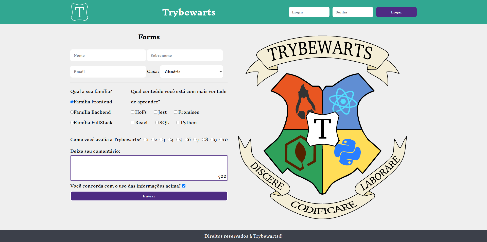

### Termos de acordo

Ao iniciar este projeto, você concorda com as diretrizes do Código de Ética e Conduta e do Manual da Pessoa Estudante da Trybe.

---

# Boas vindas ao repositório do projeto Trybewarts Wizarding School! :mage:

Você já usa o GitHub diariamente para desenvolver os exercícios, certo? Agora, para desenvolver os projetos, você deverá seguir as instruções a seguir. Fique atento a cada passo, e se tiver qualquer dúvida, nos envie por _Slack_! #vqv 🚀

Aqui você vai encontrar os detalhes de como estruturar o desenvolvimento do seu projeto a partir desse repositório, utilizando uma branch específica e um _Pull Request_ para colocar seus códigos.

---

# Sumário

- [Habilidades](#habilidades)
- [Entregáveis](#entregáveis)
  - [O que deverá ser desenvolvido](#o-que-deverá-ser-desenvolvido)
  - [Desenvolvimento](#desenvolvimento)
  - [Data de entrega](#data-de-entrega)
- [Instruções para entregar seu projeto](#instruções-para-entregar-seu-projeto)
    - [Antes de começar a desenvolver:](#antes-de-começar-a-desenvolver)
    - [Durante o desenvolvimento](#durante-o-desenvolvimento)
- [Como desenvolver](#como-desenvolver)
  - [Observações técnicas](#observações-técnicas)
  - [ESLint e Stylelint](#eslint-e-stylelint)
- [Requisitos do projeto](#requisitos-do-projeto)
  - [Lista de requisitos obrigatórios:](#lista-de-requisitos-obrigatórios)
    - [1. Crie uma barra verde na parte superior da página](#1-crie-uma-barra-verde-na-parte-superior-da-página)
    - [2. Adicione o logotipo da Trybewarts com a classe `trybewarts-header-logo` no canto esquerdo da barra superior](#2-adicione-o-logotipo-da-trybewarts-com-a-classe-trybewarts-header-logo-no-canto-esquerdo-da-barra-superior)
    - [3. Acrescente um formulário de autenticação no canto direito da barra superior contendo os inputs de login, de senha e um botão de entrar](#3-acrescente-um-formulário-de-autenticação-no-canto-direito-da-barra-superior-contendo-os-inputs-de-login-de-senha-e-um-botão-de-entrar)
    - [4. Crie um título com o texto 'Trybewarts' centralizado dentro do 'Header'](#4-crie-um-título-com-o-texto-trybewarts-centralizado-dentro-do-header)
    - [5. Adicione um formulário no corpo da página, posicionado ao lado esquerdo](#5-adicione-um-formulário-no-corpo-da-página-posicionado-ao-lado-esquerdo)
    - [6. Crie um id para o formulário do requisito 5](#6-crie-um-id-para-o-formulário-do-requisito-5)
    - [7. Adicione a logo da Trybewarts no lado direito da página](#7-adicione-a-logo-da-trybewarts-no-lado-direito-da-página)
    - [8.Acrescente no formulário os inputs de 'Nome:', 'Sobrenome:' e 'Email:'](#8acrescente-no-formulário-os-inputs-de-nome-sobrenome-e-email)
    - [9. Crie um select 'Casa' contendo quatro options](#9-crie-um-select-casa-contendo-quatro-options)
    - [10. Alinhe os campos de 'Nome' e 'Sobrenome' para que fiquem em linha](#10-alinhe-os-campos-de-nome-e-sobrenome-para-que-fiquem-em-linha)
    - [11. Alinhe os campos de 'Email' e 'Casa' para que fiquem em linha](#11-alinhe-os-campos-de-email-e-casa-para-que-fiquem-em-linha)
    - [12. Crie um campo de entrada para qual família a pessoa estudante se identifica](#12-crie-um-campo-de-entrada-para-qual-família-a-pessoa-estudante-se-identifica)
    - [13. Crie campos de entrada do tipo 'checkbox' contendo seis opções](#13-crie-campos-de-entrada-do-tipo-checkbox-contendo-seis-opções)
    - [14. Crie campo de entrada para avaliar de 1 a 10 o nível de satisfação com a Trybewarts](#14-crie-campo-de-entrada-para-avaliar-de-1-a-10-o-nível-de-satisfação-com-a-trybewarts)
    - [15. Crie uma textarea com o id 'textarea' contendo o número máximo de caracteres igual à 500](#15-crie-uma-textarea-com-o-id-textarea-e-uma-label-com-a-classe-textarea-contendo-o-número-máximo-de-caracteres-igual-à-500)
    - [16. Crie um campo de entrada do tipo 'checkbox' com o id 'agreement' para validar as informações](#16-crie-um-campo-de-entrada-do-tipo-checkbox-com-o-id-agreement-para-validar-as-informações)
    - [17. Crie um botão de Enviar para submeter o formulário](#17-crie-um-botão-de-enviar-para-submeter-o-formulário)
    - [18. Faça com que o botão 'Enviar' seja habilitado somente após a checkbox do requisito 16 ser selecionada](#18-faça-com-que-o-botão-enviar-seja-habilitado-somente-após-a-checkbox-do-requisito-16-ser-selecionada)
    - [19. Crie um rodapé no final da página](#19-crie-um-rodapé-no-final-da-página)
  - [Lista de requisitos bônus:](#lista-de-requisitos-bônus)
    - [20. Crie um contador com o ID 'counter' contendo o número de caracteres disponíveis no textarea, variando de 500 até 0, que deverá ser atualizado a medida que algo for digitado na textarea](#20-crie-um-contador-com-o-id-counter-contendo-o-número-de-caracteres-disponíveis-no-textarea-variando-de-500-até-0-que-deverá-ser-atualizado-a-medida-que-algo-for-digitado-na-textarea)
    - [21. Faça com que ao clicar no botão 'Enviar', o conteúdo do formulário seja substituído pelas informações preenchidas](#21-faça-com-que-ao-clicar-no-botão-enviar-o-conteúdo-do-formulário-seja-substituído-pelas-informações-preenchidas)
  - [Lista de requisitos não avaliativos:](#lista-de-requisitos-não-avaliativos)
    - [22. Preencha o arquivo feedback.md . Aproveite o espaço para deixar seus feedbacks sobre o projeto.](#22-preencha-o-arquivo-feedbackmd--aproveite-o-espaço-para-deixar-seus-feedbacks-sobre-o-projeto)
    - [23. Realize o desenvolvimento da versão mobile do formulário Trybewarts.](#23-realize-o-desenvolvimento-da-versão-mobile-do-formulário-trybewarts)
- [Depois de terminar o desenvolvimento (opcional)](#depois-de-terminar-o-desenvolvimento-opcional)
  - [Dicas](#dicas)
  - [Revisando um pull request](#revisando-um-pull-request)
- [Avisos finais](#avisos-finais)

# Habilidades

Neste projeto, verificamos se você é capaz de:

  * Criar formulários em HTML;

  * Utilizar CSS Flexbox para criar layouts flexíveis;

  * Criar regras CSS específicas para serem aplicadas a dispositivos móveis;

  * Construir páginas que alteram o seu layout de acordo com a orientação da tela;

---

# Entregáveis

Para entregar o seu projeto você deverá criar um Pull Request neste repositório.

Lembre-se que você pode consultar nosso conteúdo sobre [Git & GitHub](https://app.betrybe.com/course/fundamentals/git) sempre que precisar!

## O que deverá ser desenvolvido

Neste projeto, você irá desenvolver uma página de formulário da Escola de Magia de Trybewarts, em que as pessoas estudantes poderão enviar seus feedbacks sobre a escola. O tema desse projeto é baseado na obra 'Harry Potter', de J. K. Rowling, já que programar é o mais próximo que podemos chegar de algo *verdadeiramente mágico*! Mas não se preocupe se não tiver conhecimento sobre o universo da obra original, pois criamos nossa própria versão da Escola de Bruxaria e você terá todas as informações necessárias para a construção do projeto nesse _readme_!

## Desenvolvimento

⚠️ É importante que seus arquivos tenham exatamente estes nomes! ⚠️

O seu Pull Request deverá conter os arquivos `index.html`, `style.css` e `script.js`, que conterão seu código HTML, CSS e JavaScript, respectivamente.

Você pode adicionar outros arquivos se julgar necessário. Qualquer dúvida, procure a monitoria.

## Data de entrega

  - Projeto em dupla.
  - Serão `X` dias de projeto.
  - Data de entrega para avaliação final do projeto: `DD/MM/YYYY - 14:00h`.

# Instruções para entregar seu projeto

### Antes de começar a desenvolver:

#### Esse projeto tem um fluxo um pouco diferente dos outros. Os passos 1 a 6 devem ser feitos por uma pessoa da dupla (a que vai criar a branch de trabalho). A outra pessoa deve fazer apenas o passo 1 e depois mudar para a branch criada pela primeira pessoa.
  Exemplo:  `git checkout joaozinho-trybewarts-project`

1. Clone o repositório
  * `git clone git@github.com:betrybe/sd-0x-project-trybewarts.git`.
  * Entre na pasta do repositório que você acabou de clonar:
    * `cd sd-0x-project-trybewarts`

2. Crie uma branch a partir da branch `master`
  * Verifique que você está na branch `master`
    * Exemplo: `git branch`
  * Se não estiver, mude para a branch `master`
    * Exemplo: `git checkout master`
  * Agora, crie uma branch onde você vai guardar os `commits` do seu projeto
    * Você deve criar uma branch no seguinte formato: `nome-de-usuario-nome-do-projeto`
    * Exemplo: `git checkout -b joaozinho-trybewarts-project`

3. Crie na raiz do projeto os arquivos que você precisará desenvolver:
  * Verifique que você está na raiz do projeto
    * Exemplo: `pwd` -> o retorno vai ser algo tipo _/Users/joaozinho/code/**sd-0x-project-trybewarts**_
  * Crie os arquivos index.html, style.css e script.js
    * Exemplo: `touch index.html style.css script.js`

4. Adicione as mudanças ao _stage_ do Git e faça um `commit`
  * Verifique que as mudanças ainda não estão no _stage_
    * Exemplo: `git status` (devem aparecer listados os novos arquivos em vermelho)
  * Adicione o novo arquivo ao _stage_ do Git
      * Exemplo:
        * `git add .` (adicionando todas as mudanças - _que estavam em vermelho_ - ao stage do Git)
        * `git status` (devem aparecer listados os arquivos em verde)
  * Faça o `commit` inicial
      * Exemplo:
        * `git commit -m 'iniciando o projeto. VAMOS COM TUDO :rocket:'` (fazendo o primeiro commit)
        * `git status` (deve aparecer uma mensagem tipo _nothing to commit_ )

5. Adicione a sua branch com o novo `commit` ao repositório remoto
  * Usando o exemplo anterior: `git push -u origin joaozinho-trybewarts-project`

6. Crie um novo `Pull Request` _(PR)_
  * Vá até a página de _Pull Requests_ do [repositório no GitHub](https://github.com/tryber/sd-0x-project-trybewarts/pulls)
  * Clique no botão verde _"New pull request"_
  * Clique na caixa de seleção _"Compare"_ e escolha a sua branch **com atenção**
  * Clique no botão verde _"Create pull request"_
  * Adicione uma descrição para o _Pull Request_, um título claro que o identifique, e clique no botão verde _"Create pull request"_
  * **Não se preocupe em preencher mais nada por enquanto!**
  * Volte até a [página de _Pull Requests_ do repositório](https://github.com/tryber/sd-0x-project-trybewarts/pulls) e confira que o seu _Pull Request_ está criado

---

### Durante o desenvolvimento

* Faça `commits` das alterações que você fizer no código regularmente;

* Lembre-se de sempre após um (ou alguns) `commits` atualizar o repositório remoto;

* Os comandos que você utilizará com mais frequência são:

  1. `git status` _(para verificar o que está em vermelho - fora do stage - e o que está em verde - no stage)_;

  2. `git add` _(para adicionar arquivos ao stage do Git)_;

  3. `git commit` _(para criar um commit com os arquivos que estão no stage do Git)_;

  5. `git push -u nome-da-branch` _(para enviar o commit para o repositório remoto na primeira vez que fizer o `push` de uma nova branch)_;

  4. `git push` _(para enviar o commit para o repositório remoto após o passo anterior)_.

---

# Como desenvolver

Você irá desenvolver este projeto em **dupla** e é fundamental que siga as instruções do repositório.

Todos os requisitos tem como base a página a seguir, que representa um formulário de avaliação da **Escola de Magia de Trybewarts**. Use a imagem do site como base e respeite o posicionamento dos elementos, mas quanto às cores e elementos de design que não interfiram nesses aspectos sinta-se livre para deixar a sua criatividade fluir!



---

## Observações técnicas

Algumas coisas devem seguir um padrão pré-estabelecido para que os testes de correção funcionem corretamente.

⚠️ Leia-os atentamente e siga à risca o que for pedido. Em particular, **atente-se para os nomes de _ids_ que alguns elementos de seu projeto devem possuir**. ⚠️

⚠ **Alguns requisitos pedem para utilizar Flexbox. Tenha atenção no que é solicitado caso vá usar algum framework CSS para que os requisitos sejam atendidos.** ⚠

O não cumprimento de um requisito, total ou parcialmente, impactará em sua avaliação.

* Os requisitos do seu projeto são avaliados automaticamente, sendo utilizada a resolução de tela de `1366 x 768` (1366 pixels de largura por 768 pixels de altura).

  * #### ⚠️ Logo, recomenda-se desenvolver seu projeto usando a mesma resolução, via instalação [deste plugin](https://chrome.google.com/webstore/detail/window-resizer/kkelicaakdanhinjdeammmilcgefonfh?hl=en) do `Chrome` para facilitar a configuração da resolução. ⚠️

* Atente-se para o tamanho das imagens que você utilizará neste projeto. **Não utilize imagens com um tamanho maior que _500Kb_.**
  * #### ⚠️ Utilize uma ferramenta [como esta](https://picresize.com/pt) para redimensionar as imagens. ⚠️

  * Caso a avaliação falhe com alguma mensagem de erro parecida com `[409:0326/130838.878602:FATAL:memory.cc(22)] Out of memory. size=4194304`, provavelmente as imagens que você está utilizando estão muito grandes. Tente redimensiona-las para um tamanho menor.

* Para verificar se a sua avaliação foi computada com sucesso, você pode verificar os **detalhes da execução do avaliador**.

  * Na página do seu _Pull Request_, acima do "botão de merge", procure por _**"Evaluator job"**_ e clique no link _**"Details"**_;

  * Na página que se abrirá, procure pela linha _**"Cypress evaluator step"**_ e clique nela;

  * Analise os resultados a partir da mensagem _**"(Run Starting)"**_;

  * Caso tenha dúvidas, consulte [este vídeo](https://vimeo.com/420861252) ou procure a monitoria.

* Você tem liberdade para adicionar novos comportamentos ao seu projeto, seja na forma de aperfeiçoamentos em requisitos propostos ou novas funcionalidades, **desde que tais comportamentos adicionais não conflitem com os requisitos propostos**.

  * Em outras palavras, você pode fazer mais do que for pedido, mas nunca menos.

* Contudo, tenha em mente que **nada além do que for pedido nos requisitos será avaliado**. _Esta é uma oportunidade de você exercitar sua criatividade e experimentar com os conhecimentos adquiridos._

---

## ESLint e Stylelint

Para garantir a qualidade do código, vamos utilizar neste projeto os linters `ESLint` e `Stylelint`.
Assim o código estará alinhado com as boas práticas de desenvolvimento, sendo mais legível
e de fácil manutenção! Para rodá-los localmente no projeto, execute os comandos abaixo:

```bash
  npm run lint
  npm run lint:styles
```

Em caso de dúvidas, confira o material do course sobre [ESLint e Stylelint](https://app.betrybe.com/course/real-life-engineer/eslint).

⚠️ Lembre-se que o seu projeto só será avaliado se estiver passando pelos _checks_ dos **linters**.

---

## Cypress

Cypress é uma ferramenta de teste de front-end desenvolvida para a web.
Você pode rodar o cypress localmente para verificar se seus requisitos estão passando, para isso execute o seguinte comando:

```bash
npx cypress open
```

Você também pode assistir a [este](https://vimeo.com/539240375/a116a166b9) vídeo 😉🎙

**Para rodar o cypress é preciso ter rodado o comando npm install anteriormente.**

---

# Requisitos do projeto

Caso você faça o download de bibliotecas externas, utilize o diretório libs (a partir da raiz do projeto) para colocar os arquivos (*.css, *.js, etc...) baixados.

## Lista de requisitos obrigatórios:

### 1. Crie uma barra verde na parte superior da página

  Pontos importantes:
  * Esta barra deve possuir a classe `header`
  * A classe `header` deve determinar que o elemento é um flex container
  * A classe header deve possuir a propriedade `background-color: rgb(50, 167, 145)`

  #### O que será verificado:

  - Existe um elemento com a classe `header`
  - O elemento possui a propriedade CSS `display: flex`
  - O elemento possui a propriedade CSS `background-color: rgb(50, 167, 145)`

### 2. Adicione o logotipo da Trybewarts com a classe `trybewarts-header-logo` no canto esquerdo da barra superior

  Pontos importantes:
  * Deve existir um elemento img com a classe `trybewarts-header-logo`
  * O logotipo deve estar alinhado à esquerda dentro da barra verde
  * O atributo `src` do logotipo deve apontar para `images/trybewarts-header-logo.svg`

  #### O que será verificado:

  - Existe um elemento `img` com a classe `trybewarts-header-logo`
  - O elemento está alinhado à esquerda da barra
  - O elemento possui o atributo `src` apontando para `images/trybewarts-header-logo.svg`

### 3. Acrescente um formulário de autenticação no canto direito da barra superior contendo os inputs de login, de senha e um botão de entrar

  Pontos importantes:
  * O formulário deve ter a classe `trybewarts-login`
  * O alinhamento à direita deve ser feito usando a propriedade flex que faz os elementos terem o espaçamento máximo *entre* eles dentro de um determinado container
  * Existem dois inputs e um botão dentro do formulário
  * Os inputs deverão conter placeholders com as palavras *'Login'* e *'Senha'*,
  * O formulário deve ser um flex container
  * O formulário deve aceitar como padrão o login 'tryber@teste.com' e a senha '123456'
    - Caso o login ou a senha sejam **diferentes** do padrão, ao clicar no botão deverá ser emitido um alerta contendo o texto *'Login ou senha inválidos.'*
    - Caso o login ou a senha sejam **as mesmas** definidas por padrão, ao clicar no botão deverá ser emitido um alerta contendo o texto *'Olá, Tryber!'*

  #### O que será verificado:

  - Existe um elemento `form` com a classe `trybewarts-login`
  - O elemento está alinhado à direita dentro da barra verde
  - Existem dois inputs e um botão dentro do formulário
  - Os inputs de login e senha possuem, respectivamente, os _placeholders_ `Login` e `Senha`
  - O formulário possui a propriedade CSS `display: flex`
  - O click no botão de login dispara um alert com o texto "Login ou senha inválidos", no caso de erro de preenchimento dos dados
  - O click no botão de login dispara um alert com o texto "Olá, Tryber!", no caso de preenchimento correto dos dados.

### 4. Crie um título com o texto 'Trybewarts' centralizado dentro do 'Header'

Pontos importantes:
  * Deve existir um elemento `<h1>` com o id `trybewarts-header-title`
  * O elemento deve possuir o texto "Trybewarts"
  * O título deverá estar centralizado na barra verde
    - O header deve ter exatamente três elementos filhos
    - O filho do meio deve ser o título

  #### O que será verificado:

  - Existe um elemento `h1` com o id `trybewarts-header-title`
  - O elemento possui um conteúdo de texto `Trybewarts`
  - O elemento com a classe `header` deve possuir exatos `3` elementos filhos
  - O filho do meio do elemento com a classe `header` deve ser o título h1 `Trybewarts`

### 5. Adicione um formulário no corpo da página, posicionado ao lado esquerdo

  Pontos importantes:
  * Deve existir um formulário com o id `evaluation-form`
  * O formulário deve estar inserido na tag `main` do HTML
  * Tanto o formulário quanto o `main` devem ser flex containers
  * O formulário deve ter uma largura de 675px

  #### O que será verificado:

  - Existe um elemento `form` com o id `evaluation-form`
  - O elemento está dentro da tag `main`
  - O elemento `main` e o `form` possuem a propriedade CSS `display: flex`
  - O elemento `form` possui a propriedade CSS `width: 675px`

### 6. Faça com que o formulário do requisito 5 seja um container flex com o eixo principal vertical

  Ponto importante:
  * Alinhe o eixo principal dessa classe para ser o eixo vertical

  #### O que será verificado:

  - Existe um elemento com o ID `evaluation-form`
  - O elemento possui a propriedade CSS `display: flex`
  - O elemento possui a propriedade CSS `flex-direction: column`

### 7. Adicione a logo da Trybewarts no lado direito da página

  Pontos importantes:
  * Deve possuir o id ``trybewarts-forms-logo``
  * O atributo `src` do logotipo deve apontar para ``images/trybewarts-colored.svg``
  * A imagem deve possuir um `height` de `500px`

  #### O que será verificado:

  - Existe um elemento `img` com o id `trybewarts-forms-logo`
  - O elemento possui o atributo `src` apontando para `images/trybewarts-colored.svg`

### 8.Acrescente no formulário os inputs de 'Nome:', 'Sobrenome:' e 'Email:'

  Pontos importantes:
  * Inputs de *'Nome'*, *'Sobrenome'* e *'Email'* deverão ser criados
  * Os inputs devem possuir os ids 'input-name', 'input-lastname' e 'input-email'
  * Os inputs deverão conter um placeholder com *'Nome'*, *'Sobrenome'* e *'Email'* em seus respectivos campos

  #### O que será verificado:

  - Existe 3 elementos inputs com os IDs `input-name`, `input-lastname` e `input-email`
  - Os inputs de nome, sobrenome e email devem possuir, respectivamente, o atributo de `placeholder` com os valores `Nome`, `Sobrenome` e `Email`

### 9. Crie um select 'Casa' contendo quatro options

  Pontos importantes:
  * O select deverá conter o id ``house``
  * Deverá conter a opção com text e value `Gitnória` e com o id ``gitnoria-house``
  * Deverá conter a opção com text e value `Reactpuff` e com o id ``reactpuff-house``
  * Deverá conter a opção com text e value `Corvinode` e com o id ``corvinode-house``
  * Deverá conter a opção com text e value `Pytherina` e com o id ``pytherina-house``

  #### O que será verificado:
  
  - Existe um elemento `select` com o id `house`
  - Existe um elemento `option` com o id `gitnoria-house`
  - Existe um elemento `option` com o id `reactpuff-house`
  - Existe um elemento `option` com o id `corvinode-house`
  - Existe um elemento `option` com o id `pytherina-house`

### 10. Alinhe os campos de 'Nome' e 'Sobrenome' para que fiquem em linha

  Pontos importantes:
  * Os campos de *'Nome'* e *'Sobrenome'* devem estar lado a lado

  #### O que será verificado:

  - O campo de `Sobrenome` está à direita do campo de `Nome`

### 11. Alinhe os campos de 'Email' e 'Casa' para que fiquem em linha

  Pontos importantes:
  * Os campos de *'Email'* e *'Casa'* devem estar abaixo dos de *'Nome'* e *'Sobrenome'*
  * Os campos de *'Email'* e *'Casa'* devem estar lado a lado
  * O campo *'Casa'* deve possuir o `id="house"`

  #### O que será verificado:

  - O campo de `Casa` está à direita do campo de `Email`

### 12. Crie um campo de entrada para qual família a pessoa estudante se identifica

  Pontos importantes:
  * Um elemento com o id `label-family` e o texto *"Qual sua família?"* deverá ser criado
  * O campo deve ser formado por três radio buttons com os valores *"Frontend"*, *"Backend"* e *"FullStack"*
  * Os radio buttons devem ter o atributo `name` com o valor *"family"*
  * Posicione os radio buttons para ficar abaixo um do outro
  * Posicione os radio buttons abaixo do label

  #### O que será verificado:

  - Existe um elemento `label` com o id `label-family` que possui um conteúdo de texto `Qual sua família?`
  - Existe um elemento `input` com o atributo `value="Frontend"`
  - Existe um elemento `input` com o atributo `value="Backend"`
  - Existe um elemento `input` com o atributo `value="FullStack"`
  - Existem 3 elementos `input` do tipo `radio` com o atributo `name="family"`
  - Os inputs do tipo `radio` estão um abaixo do outro
  - Os 3 inputs do tipo `radio` estão abaixo do texto da label

### 13. Crie campos de entrada do tipo 'checkbox' contendo seis opções

  Pontos importantes:
  * Um elemento com o id `label-content` e o texto *"Qual conteúdo você está com mais vontade de aprender?"* deverá ser criado
  * O campo deve ser formado por seis checkbox com as seguintes opções (seguindo esta ordem): *HoFs*, *Jest*, *Promises*, *React*, *SQL* e *Python*
  * Os valores (`value`) dos campos são, respectivamente: *HoFs*, *Jest*, *Promises*, *React*, *SQL*, *Python*
  * As classes (`class`) dos campos devem ser `subject`
  * Posicione as checkbox para ficar lado a lado
  * Posicione as checkbox a abaixo do label

  #### O que será verificado:

  - Existe um elemento `label` com o id `label-content` que possui um conteúdo de texto `Qual conteúdo você está com mais vontade de aprender?`
  - Existe um `input` com o atributo `value="HoFs"`
  - Existe um `input` com o atributo `value="Jest"`
  - Existe um `input` com o atributo `value="Promises"`
  - Existe um `input` com o atributo `value="React"`
  - Existe um `input` com o atributo `value="SQL"`
  - Existe um `input` com o atributo `value="Python"`
  - Os elementos checkbox então posicionados abaixo da label

### 14. Crie campo de entrada para avaliar de 1 a 10 o nível de satisfação com a Trybewarts

  Pontos importantes:
  * Um elemento com o id `label-rate` e o texto *"Como você avalia a Trybewarts?"* deverá ser criado
  * O campo deve ser formado por dez radio buttons, contendo as opções de 1 a 10
  * Os radio buttons devem ter o atributo `value` com o valor de suas opções de 1 a 10.
  * Os radio buttons devem ter o atributo `name` com o valor *"rate"*
  * Posicione os radio buttons para ficar lado a lado
  * Posicione os radio buttons à direita da label

  #### O que será verificado:

  - Existe um elemento `label` com o id `label-rate` que possui um conteúdo de texto `Como você avalia a Trybewarts?`
  - Existem 10 `radio-buttons` com o atributo `name="rate"`
  - Existem 10 `radio-buttons` contendo o atributo `value` de 1 a 10  
  - Os `radio-buttons` estão à direita do texto da label

### 15. Crie uma textarea com o id 'textarea' e uma label com a classe 'textarea' contendo o número máximo de caracteres igual à 500

  Pontos importantes:
  * Uma label com a classe `textarea` e o texto *"Deixe seu comentário:"* deverá ser criado
  * O campo `textarea` deverá ter o máximo de 500 caracteres

  #### O que será verificado:

  - Existe uma `label` com a classe `textarea` e o texto `Deixe seu comentário:`
  - O elemento `textarea` possui um limite de 500 caracteres

### 16. Crie um campo de entrada do tipo 'checkbox' com o id 'agreement' para validar as informações

  Pontos importantes:
  * Um rótulo (label) com o id `label-infos` e o texto *"Você concorda com o uso das informações acima?"* deverá ser criado
  * O campo deve ser formado por um checkbox
  * O campo de 'checkbox' deve possuir o ID `agreement`
  * Posicione a checkbox ao lado da label

  #### O que será verificado:

  - Existe uma label com o id `label-infos` que possui o texto `Você concorda com o uso das informações acima?`
  - Existe um input do tipo `checkbox` com o id `agreement`

### 17. Crie um botão de Enviar para submeter o formulário

  Pontos importantes:
  * Um botão do tipo `submit` deverá ser criado
  * O botão deve possuir o ID `submit-btn`
  * Deverá conter o texto *'Enviar'*

  #### O que será verificado:

  - Existe um botão do tipo `submit` com o id `submit-btn` e o texto `Enviar`

### 18. Faça com que o botão 'Enviar' seja habilitado somente após a checkbox do requisito 16 ser selecionada

  Pontos importantes:
  * O botão deverá estar desabilitado caso a checkbox não esteja selecionada
  * O botão deverá ser habilitado caso a checkbox seja selecionada

  #### O que será verificado:

  - O botão está inicialmente desabilitado
  - O botão torna-se habilitado, ao marcar o campo com id `agreement`

### 19. Crie um rodapé no final da página

  Pontos importantes:
  * O rodapé deverá conter o texto *"Direitos reservados à Trybewarts©"*

  #### O que será verificado:

  - Existe um elemento `footer` deve possuir o texto `Direitos reservados à Trybewarts©`

## Lista de requisitos bônus:

### 20. Crie um contador com o ID 'counter' contendo o número de caracteres disponíveis no textarea, variando de 500 até 0, que deverá ser atualizado a medida que algo for digitado na textarea

  Pontos importantes:
  * O contador deverá possuir o ID `counter`
  * O contador inicialmente deve possuir o valor `500`
  * O contador deverá decrementar a medida que algo for escrito no campo `textarea`
  * O contador deverá incrementar a medida que algo for deletado no campo `textarea`
  * O elemento `textarea` deverá possuir `id="textarea"`

  #### O que será verificado:

  - Existe um elemento com o id `counter`
  - Existe um elemento com o id `textarea`
  - O preenchimento do campo de `textarea` altera o número apresentado no elemento `#counter`

### 21. Faça com que ao clicar no botão 'Enviar', o conteúdo do formulário seja substituído pelas informações preenchidas
  Pontos importantes:
  * Todos os campos do formulário devem ser substituídos.
  * Deve haver um campo com o formato "Nome: Alguem Aqui"
  * Deve haver um campo com o formato "Email: email@mail.com"
  * Deve haver um campo com o formato "Casa: Casa Escolhida"
  * Deve haver um campo com o formato "Família: Família Escolhida"
  * Deve haver um campo com o formato "Matérias: Matérias, Marcadas, Aqui"
  * Deve haver um campo com o formato "Avaliação: NotaAqui"
  * Deve haver um campo com o formato "Observações: Observações aqui"

  #### O que será verificado:

  - Os `inputs` tipo `checkbox` referentes à lista de conteúdo possuem `class="subject"`
  - Ao clicar no botão de enviar, existe um texto no formato `Nome: -Nome- -Sobrenome-`
  - Ao clicar no botão de enviar, existe um texto no formato `Email: -Email-`
  - Ao clicar no botão de enviar, existe um texto no formato `Casa: -Casa-`
  - Ao clicar no botão de enviar, existe um texto no formato `Família: -Família-`
  - Ao clicar no botão de enviar, existe um texto no formato `Matérias: -Matérias Selecionadas-`
  - Ao clicar no botão de enviar, existe um texto no formato `Avaliação: -Avaliação-`
  - Ao clicar no botão de enviar, existe um texto no formato `Observações: -Observações-`

---

## Lista de requisitos não avaliativos:

Esses requisitos **não** são verificáveis pelo avaliador automático.

### 22. Preencha o arquivo feedback.md . Aproveite o espaço para deixar seus feedbacks sobre o projeto.

  - Utilize o arquivo feedback.md para deixar comentários e sugestões sobre o projeto! Para nós, é muito importante saber se vocês tiveram uma boa experiência e se foi praticar seus conhecimentos com o Trybewarts!

### 23. Realize o desenvolvimento da versão mobile do formulário Trybewarts.

  - Utilize media queries para inserir breakpoints para telas de diferentes tamanhos.
  - Leve em conta a largura da tela e a experiência do usuário ao reorganizar o layout para dispositivos menores.
  - Tente inserir um 'menu hambúrguer' na barra superior para lidar com o login usando javascript. Se não conseguir, tente criar uma página separada de login, uma prática muito comum.
  - Deixe sua criatividade fluir! Preferimos não avaliar esse requisito justamente pra que você tenha liberdade para executar a responsividade da maneira que você achar mais agradável!

---

# Depois de terminar o desenvolvimento

#### A pessoa dona da branch deve garantir que o último commit nessa branch é seu. Pode ser feita alguma alteração que não afete o cumprimento dos requisitos para realizar o commit.

A outra pessoa integrante da dupla deve criar uma nova `branch` a partir da `branch` de trabalho _(a primeira branch criada pela equipe)_.
Exemplo: 
1. Use `git branch` para ter certeza de que está na branch de trabalho;
2. Caso não esteja use `git checkout joaozinho-trybewarts-project`  para trocar de `branch`;
3. User `git checkout -b mariazinha-trybewarts-project` para criar uma nova branch a partir da branch anterior (`joaozinnho-trybewarts-project`);


#### Garanta que o último commit da branch é de autoria da pessoa dona de cada branch. Novamente pode ser feita alguma alteração que não afete o cumprimento dos requisitos para realizar o commit.

1. Adicione sua branch com o novo `commit` ao repositório remoto

   * Usando o exemplo anterior: `git push -u origin mariazinha-trybewarts-project`
   
2. Crie um novo `Pull Request` (PR)
  * Vá até a página de _Pull Requests_ do [repositório no GitHub](https://github.com/tryber/sd-0x-project-trybewarts/pulls)
  * Clique no botão verde _"New pull request"_
  * Clique na caixa de seleção _"Compare"_ e escolha a sua branch **com atenção**
  * Clique no botão verde _"Create pull request"_
  * Adicione uma descrição para o _Pull Request_, um título claro que o identifique, e clique no botão verde _"Create pull request"_
  * **Não se preocupe em preencher mais nada por enquanto!**
  * Volte até a [página de _Pull Requests_ do repositório](https://github.com/tryber/sd-0x-project-trybewarts/pulls) e confira que o seu _Pull Request_ está criado
 
#### ⚠️ Para o seu projeto ser avaliado você deve se assegurar que o último commit na branch é da pessoa dona da branch.


---

## Code Review (opcional)

Para sinalizar que o seu projeto está pronto para o _"Code Review"_ dos seus colegas, faça o seguinte:

* Vá até a página **DO SEU** _Pull Request_, adicione a label de _"code-review"_ e marque seus colegas:

  * No menu à direita, clique no _link_ **"Labels"** e escolha a _label_ **code-review**;

  * No menu à direita, clique no _link_ **"Assignees"** e escolha **o seu usuário**;

  * No menu à direita, clique no _link_ **"Reviewers"** e digite `students`, selecione o time `tryber/students-sd-0x`.

Caso tenha alguma dúvida, [aqui tem um vídeo explicativo](https://vimeo.com/362189205).

## Dicas

- Para colocar sua página no [GitHub Pages](https://pages.github.com/), não é necessário remover o conteúdo que já está lá, você pode apenas adicionar essa nova página. Para isso, todo o conteúdo desse projeto deve ser colocado em uma pasta `/projetos/trybewarts`.

---

## Revisando um pull request

À medida que você e as outras pessoas que estudam na Trybe forem entregando os projetos, vocês receberão um alerta via Slack para também fazer a revisão dos Pull Requests dos seus colegas. Fiquem atentos às mensagens do "Pull Reminders" no Slack!

Use o material que você já viu sobre [Code Review](https://course.betrybe.com/real-life-engineer/code-review/) para te ajudar a revisar os projetos que chegaram para você.

---

# Avisos finais

Ao finalizar e submeter o projeto, não se esqueça de avaliar sua experiência preenchendo o formulário. Leva menos de 3 minutos!

Link: [FORMULÁRIO DE AVALIAÇÃO DE PROJETO](https://be-trybe.typeform.com/to/ZTeR4IbH)

O avaliador automático não necessariamente avalia seu projeto na ordem em que os requisitos aparecem no readme. Isso acontece para deixar o processo de avaliação mais rápido. Então, não se assuste se isso acontecer, ok?

---
